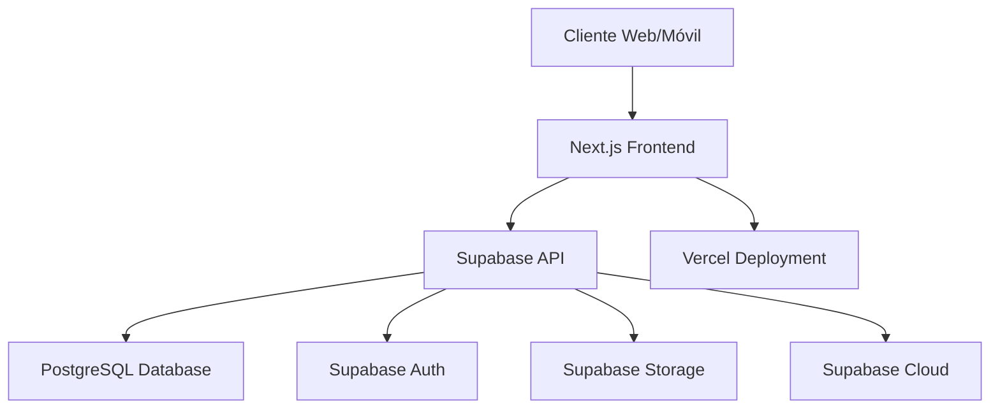

# Documento de Diseño - Sistema de Paga Diario

## Visión General

El Sistema de Paga Diario es una aplicación web full-stack que utiliza una arquitectura moderna basada en Supabase como Backend-as-a-Service (BaaS) y Next.js como framework frontend. La aplicación está diseñada para ser responsive, escalable y fácil de mantener, con un enfoque especial en la experiencia móvil para cobradores en campo.

## Arquitectura

### Arquitectura General



### Stack Tecnológico

**Frontend:**
- Next.js 14+ con App Router
- TypeScript para type safety
- Bootstrap 5 para UI components y responsive design
- Supabase JavaScript SDK para integración con backend
- React Hook Form para manejo de formularios
- Chart.js para visualización de reportes

**Backend:**
- Supabase como BaaS
- PostgreSQL como base de datos principal
- Supabase Auth para autenticación
- Supabase Storage para almacenamiento de imágenes
- Row Level Security (RLS) para seguridad de datos

**Deployment:**
- Vercel para frontend
- Supabase Cloud para backend y base de datos

## Componentes e Interfaces

### Estructura de Directorios Frontend

```
src/
├── app/
│   ├── (auth)/
│   │   ├── login/
│   │   └── layout.tsx
│   ├── (dashboard)/
│   │   ├── admin/
│   │   │   ├── clients/
│   │   │   ├── collectors/
│   │   │   ├── routes/
│   │   │   └── reports/
│   │   ├── collector/
│   │   │   ├── route/
│   │   │   └── payments/
│   │   └── layout.tsx
│   ├── api/
│   └── globals.css
├── components/
│   ├── ui/
│   ├── forms/
│   ├── tables/
│   └── charts/
├── lib/
│   ├── supabase/
│   ├── utils/
│   └── types/
└── hooks/
```

### Componentes Principales

#### 1. Componentes de Autenticación
- `LoginForm`: Formulario de login con validación
- `AuthProvider`: Context provider para estado de autenticación
- `ProtectedRoute`: HOC para rutas protegidas por rol

#### 2. Componentes Administrativos
- `ClientManagement`: CRUD de clientes
- `DebtManagement`: Gestión de deudas y cronogramas
- `RouteAssignment`: Asignación de rutas a cobradores
- `Reportsdashboard`: Dashboard con métricas y gráficos

#### 3. Componentes de Cobrador
- `DailyRoute`: Lista de clientes del día
- `PaymentForm`: Formulario para registrar pagos
- `PhotoUpload`: Componente para captura de evidencias

#### 4. Componentes UI Compartidos
- `DataTable`: Tabla reutilizable con paginación
- `Modal`: Modal responsive con Bootstrap
- `LoadingSpinner`: Indicador de carga
- `Toast`: Notificaciones de usuario

## Modelos de Datos

### Esquema de Base de Datos

```sql
-- Tabla de usuarios (extendida de auth.users)
CREATE TABLE profiles (
  id UUID REFERENCES auth.users(id) PRIMARY KEY,
  email TEXT UNIQUE NOT NULL,
  full_name TEXT NOT NULL,
  role TEXT CHECK (role IN ('admin', 'collector')) NOT NULL,
  created_at TIMESTAMP WITH TIME ZONE DEFAULT NOW(),
  updated_at TIMESTAMP WITH TIME ZONE DEFAULT NOW()
);

-- Tabla de clientes
CREATE TABLE clients (
  id UUID DEFAULT gen_random_uuid() PRIMARY KEY,
  name TEXT NOT NULL,
  address TEXT NOT NULL,
  phone TEXT,
  created_by UUID REFERENCES profiles(id),
  created_at TIMESTAMP WITH TIME ZONE DEFAULT NOW(),
  updated_at TIMESTAMP WITH TIME ZONE DEFAULT NOW()
);

-- Tabla de deudas
CREATE TABLE debts (
  id UUID DEFAULT gen_random_uuid() PRIMARY KEY,
  client_id UUID REFERENCES clients(id) ON DELETE CASCADE,
  total_amount DECIMAL(10,2) NOT NULL,
  installment_amount DECIMAL(10,2) NOT NULL,
  frequency TEXT CHECK (frequency IN ('daily', 'weekly')) NOT NULL,
  start_date DATE NOT NULL,
  status TEXT CHECK (status IN ('active', 'completed', 'cancelled')) DEFAULT 'active',
  created_by UUID REFERENCES profiles(id),
  created_at TIMESTAMP WITH TIME ZONE DEFAULT NOW(),
  updated_at TIMESTAMP WITH TIME ZONE DEFAULT NOW()
);

-- Tabla de cronograma de pagos
CREATE TABLE payment_schedule (
  id UUID DEFAULT gen_random_uuid() PRIMARY KEY,
  debt_id UUID REFERENCES debts(id) ON DELETE CASCADE,
  due_date DATE NOT NULL,
  amount DECIMAL(10,2) NOT NULL,
  status TEXT CHECK (status IN ('pending', 'paid', 'overdue')) DEFAULT 'pending',
  created_at TIMESTAMP WITH TIME ZONE DEFAULT NOW()
);

-- Tabla de rutas
CREATE TABLE routes (
  id UUID DEFAULT gen_random_uuid() PRIMARY KEY,
  collector_id UUID REFERENCES profiles(id),
  route_date DATE NOT NULL,
  status TEXT CHECK (status IN ('pending', 'in_progress', 'completed')) DEFAULT 'pending',
  created_by UUID REFERENCES profiles(id),
  created_at TIMESTAMP WITH TIME ZONE DEFAULT NOW(),
  UNIQUE(collector_id, route_date)
);

-- Tabla de asignaciones de ruta
CREATE TABLE route_assignments (
  id UUID DEFAULT gen_random_uuid() PRIMARY KEY,
  route_id UUID REFERENCES routes(id) ON DELETE CASCADE,
  client_id UUID REFERENCES clients(id),
  payment_schedule_id UUID REFERENCES payment_schedule(id),
  visit_order INTEGER,
  created_at TIMESTAMP WITH TIME ZONE DEFAULT NOW()
);

-- Tabla de pagos registrados
CREATE TABLE payments (
  id UUID DEFAULT gen_random_uuid() PRIMARY KEY,
  route_assignment_id UUID REFERENCES route_assignments(id),
  payment_schedule_id UUID REFERENCES payment_schedule(id),
  amount_paid DECIMAL(10,2),
  payment_status TEXT CHECK (payment_status IN ('paid', 'not_paid', 'client_absent')) NOT NULL,
  evidence_photo_url TEXT,
  notes TEXT,
  recorded_by UUID REFERENCES profiles(id),
  recorded_at TIMESTAMP WITH TIME ZONE DEFAULT NOW()
);
```

### Políticas de Seguridad (RLS)

```sql
-- Políticas para profiles
ALTER TABLE profiles ENABLE ROW LEVEL SECURITY;
CREATE POLICY "Users can view own profile" ON profiles FOR SELECT USING (auth.uid() = id);
CREATE POLICY "Admins can view all profiles" ON profiles FOR SELECT USING (
  EXISTS (SELECT 1 FROM profiles WHERE id = auth.uid() AND role = 'admin')
);

-- Políticas para clients
ALTER TABLE clients ENABLE ROW LEVEL SECURITY;
CREATE POLICY "Admins can manage clients" ON clients FOR ALL USING (
  EXISTS (SELECT 1 FROM profiles WHERE id = auth.uid() AND role = 'admin')
);
CREATE POLICY "Collectors can view assigned clients" ON clients FOR SELECT USING (
  EXISTS (
    SELECT 1 FROM route_assignments ra
    JOIN routes r ON ra.route_id = r.id
    WHERE ra.client_id = clients.id 
    AND r.collector_id = auth.uid()
    AND r.route_date = CURRENT_DATE
  )
);

-- Políticas similares para otras tablas...
```

## Manejo de Errores

### Estrategia de Manejo de Errores

1. **Errores de Red**: Retry automático con exponential backoff
2. **Errores de Autenticación**: Redirección automática al login
3. **Errores de Validación**: Mensajes específicos en formularios
4. **Errores de Servidor**: Logging y notificación al usuario

### Implementación

```typescript
// Error boundary para captura de errores React
export class ErrorBoundary extends Component {
  // Implementación de error boundary
}

// Hook para manejo de errores de Supabase
export const useSupabaseError = () => {
  const handleError = (error: PostgrestError) => {
    // Log error y mostrar toast apropiado
  };
  return { handleError };
};
```

## Estrategia de Testing

### Tipos de Testing

1. **Unit Tests**: Componentes individuales y funciones utilitarias
2. **Integration Tests**: Flujos completos de usuario
3. **E2E Tests**: Casos de uso críticos end-to-end

### Herramientas

- **Jest + React Testing Library**: Unit e integration tests
- **Playwright**: E2E testing
- **Supabase Local Development**: Testing con base de datos local

### Casos de Prueba Críticos

1. Flujo completo de autenticación
2. Registro de pago por cobrador
3. Generación de reportes administrativos
4. Asignación de rutas
5. Carga de evidencias fotográficas

## Consideraciones de Performance

### Optimizaciones Frontend

1. **Code Splitting**: Lazy loading de rutas administrativas
2. **Image Optimization**: Next.js Image component para fotos
3. **Caching**: React Query para cache de datos de Supabase
4. **Bundle Optimization**: Tree shaking y minificación

### Optimizaciones Backend

1. **Database Indexing**: Índices en columnas frecuentemente consultadas
2. **Query Optimization**: Uso de joins eficientes y filtros
3. **Connection Pooling**: Configuración óptima de Supabase
4. **CDN**: Supabase Storage con CDN para imágenes

## Consideraciones de Seguridad

### Medidas de Seguridad

1. **Row Level Security**: Políticas estrictas en todas las tablas
2. **Input Validation**: Validación tanto en frontend como backend
3. **HTTPS Only**: Configuración SSL/TLS obligatoria
4. **Rate Limiting**: Límites en APIs sensibles
5. **Audit Logging**: Registro de acciones críticas

### Gestión de Archivos

1. **Upload Restrictions**: Solo imágenes, tamaño máximo 5MB
2. **Virus Scanning**: Integración con servicio de escaneo
3. **Access Control**: URLs firmadas para acceso a evidencias